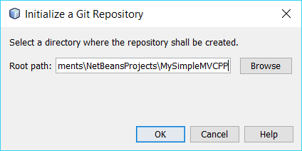
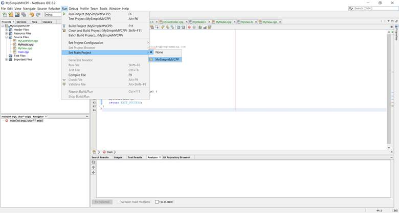
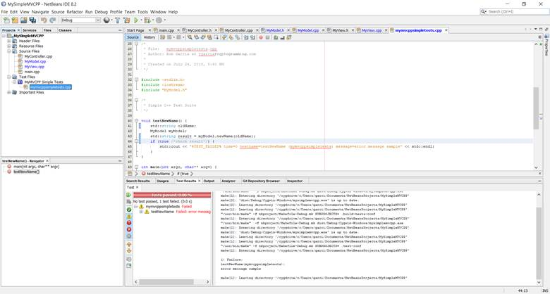

# MySimpleMVCPP

## My Simple MVCPP is a simple console implementation of the MVC in C++.

### Introduction

My Simple MVCPP is a simple console implementation of the Model-View-Controller (MVC) architectural pattern, written in C++. In actuality, it is closer to the Model-View-Adapter (MVA) pattern, since only the Controller knows the View and the Model exist, and any interaction between the View and the Model must go through the Controller. My Simple MVCPP is also a walk-through on how to implement a project correctly in NetBeans, with commenting, versioning control through GitHub, unit testing, and static code analysis.

### Step 1 - Create the Project

Open NetBeans and click on File -> New Project...:

Select "C/C++" from the Categories pane and "C/C++ Application" from the Projects pane, and then click Next:

Type "MySimpleMVCPP" in the Project Name text box and then click Finish:

If successful, NetBeans will create your project and populate the Projects pane with the default folders you will need to complete this project:

### Step 2 - Setup the Environment

Click on Tools -> Templates:

Select "C/C++" from the Templates pane and then click Settings:

Uncomment the user line and add your information (e.g., "user=Rob Garcia at rgarcia@rgprogramming.com", etc.):

Save and close the file. Click on File -> Project Properties (MySimpleMVCPP):

Select "License Headers" from the Categories pane. Click on the drop-down list next to "Use global license" and select the license you wish to use (e.g., MIT License, etc."). If you are not certain which license you need, check out [https://choosealicense.com/](https://choosealicense.com/):

Click OK when finished. While the license header for auto-generated main.cpp will not change, all subsequent source files will contain the desired license header. If you wish to change the main.cpp license header, feel free to do so:

### Step 3 - Create a Repository

Before continuing to the next step, make sure you have created a repository for MySimpleMVCPP in [GitHub](https://github.com/) and copied its URL:

Select the MySimpleMVCPP root node in the Projects pane by clicking on it once. Next, click on Team -> Git -> Initialize Repository:

The root path should match your project directory:

Click OK and allow NetBeans to initialize the repository (errors will appear in the Output Pane). If successful, we need to do a pull from the remote repository first before we push the commit. This is because GitHub considers the creation of License and Readme.md the initial commit to the repository:

This commit will conflict with your local repository and you will receive a REJECTED_NONFASTFORWARD error if you try to push the local commit to the remote repository:

> **NOTE** - The same error will occur if you make any changes to the remote repository through GitHub instead of through NetBeans.

Therefore, click on Team -> Remote -> Pull..:

Ensure that the Repository URL is correct, as well as the login information, and then click Next:

Select the "master -> origin/master [A]" branch in the Remote Branches pane (the [A] means that the branch will be added to the local repository) and click Finish:

Check the Output pane for any errors. If successful, click on Team -> Commit to commit MySimpleMVCPP to your local repository:

You should see a listing of all the project files in green, with an "Added" status and a "Commit" action. Click on Commit to continue:

Once again, check the Output pane for errors. If successful, click on Team -> Remote -> Push...:

Ensure that the Repository URL is correct, as well as the login information, and then click Next:

Select the "master -> master [U]" branch in the Local Branches pane (the [U] means that the branch is updated but unmerged) and click Next:

Select the "master -> origin/master [U]" branch in the Remote Branches pane and click Finish:

Check for errors in the Output pane. If successful, you should see the commit in your GitHub account:

### Step 4 - Writing the Code

Click on File -> New File...:

Select "C/C++" from the Categories pane and "C/C++ Class" from the File Types pane, and then click Next:

Type "MyController" in the Class Name text box and then click Finish:

NetBeans will create a MyController.h file in the Header Files folder, as well as a MyController.cpp file in the Source Files folder. NetBeans will also open both files in the Editor pane. Notice the both files are colored green, which means that they have not been committed to the repository:

Notice that NetBeans auto-generated a constructor, a copy constructor, and a destructor. This is NetBeans' way of implementing "[The Rule of Three](https://en.wikipedia.org/wiki/Rule_of_three_(C%2B%2B_programming))". For several reasons, we will not use copy constructors and destructors in this example, so you may remove those methods from the source and header file, leaving just the base constructor:

Repeat the process twice, adding a MyModel class and MyView class. Remove the copy constructors and destructors from the source and header files of these classes as well.

Now, we will add the code. Starting with main.cpp, modify or add the following code:

    /* main.cpp */
    #include <iostream.h>
    #include "MyController.h"

    /*
    * 
    */
    int main(int argc, char** argv) {
        // Instantiate controller
        MyController m;
        return EXIT_SUCCESS;
    }

---

    /* MyController.h */
    #ifndef MYCONTROLLER_H
    #define MYCONTROLLER_H

    #include <iostream.h>

    class MyController {
    public:
        MyController();
    private:
        std::string userName;
    };

    #endif /* MYCONTROLLER_H */

---

    /* MyController.cpp */
    #include "MyController.h"
    #include "MyModel.h"
    #include "MyView.h"

    MyController::MyController() {
        // Instantiate classes
        MyView v;
        MyModel m;
        // Get data from view
        userName = v.whoAreYou();
        // Send data to model and get manipulated data
        m.setName(userName);
        userName = m.newName();
        // Send manipulated data to view
        v.salutation(userName);
    }

---

NOTE - The above code can be truncated to the following

     m.setString(v.whoAreYou());
     v.salutation(m.newName());

---

    /* MyModel.h */
    #ifndef MYMODEL_H
    #define MYMODEL_H

    #include <iostream.h>

    class MyModel {
    public:
        MyModel();
        std::string getName();
        void setName(std::string n);
        std::string newName();
    private:
        std::string name;
    };

    #endif /* MYMODEL_H */

---

    /* MyModel.cpp */
    #include "MyModel.h"

    MyModel::MyModel() {

    }

    /// Name getter
    std::string MyModel::getName() {
        return name;
    }

    /// Name setter
    void MyModel::setName(std::string n) {
        name = n;
    }

    /**
    * Adds an epithet to the user's name.
    * @return The modified user's name.
    */
    std::string MyModel::newName() {
        return (getName() + " the Great!");
    }

---

    /* MyView.h */
    #ifndef MYVIEW_H
    #define MYVIEW_H

    #include <iostream.h>

    class MyView {
    public:
        MyView();
        std::string whoAreYou();
        void salutation(std::string newName);
    private:

    };

    #endif /* MYVIEW_H */

---

    /* MyView.cpp */
    #include "MyView.h"

    MyView::MyView() {

    }

    /**
    * Asks for the user's name.
    * @return The user's name.
    */
    std::string MyView::whoAreYou() {
        std::string yourName;
        std::cout << "Hello, World!" << std::endl;
        std::cout << "What is your name: ";
        std::getline(std::cin, yourName);
        return yourName;
    }

    /**
    * Displays the modified user's name.
    * @param newName The modified user's name.
    */
    void MyView::salutation(std::string newName) {
        std::cout << "Your new name is " << newName << std::endl;
    }

---

Once that is complete, click on Run -> Set Main Project, and select MySimpleMVCCP:

Run the project by pressing <kbd>F6</kbd>. Using "Robert" as your name, you should get the following result:

    Hello, World!
    What is your name: Robert
    Your new name is Robert the Great!

    RUN SUCCESSFUL (total time: 17s)

### Step 5 - Unit Testing

Hey, but what about the unit tests? I am a believer in [Ken Beck's Test-Driven Development (TDD)](http://rgprogramming.com/2017/11/05/test-driven-development-tdd/), but, right now, our code does not contain "an IF statement, a loop, switch or case statements, calculations, or any other type of decision-making code;" getters and setters manipulate properties without using logic (Osherove, 2014).

However, adding unit tests are important to preparing a project properly, so we will add some logic, as well as a test, using NetBeans' own simple test framework.

> **NOTE** - You can use another framework, such as CppUnit, if you like, by following the instructions here: [https://netbeans.org/kb/docs/cnd/c-unit-test.html](https://netbeans.org/kb/docs/cnd/c-unit-test.html)

Modify the model and controller as follows:

MyController.cpp: Change...

    userName = m.newName();

...to:

    userName = m.newName(m.getName());

MyModel.h: Change...

    std::string newName();

...to:

    std::string newName(std::string oldName);

MyModel.cpp: Change the code in the newName function to the following:

    /**
    * Adds an epithet to a name.
    * @param oldName The original name
    * @return The modified name
    */
    std::string MyModel::newName(std::string oldName) {
        if(oldName.length() <= 6) {
            return (oldName + " the Great!");
        }
        else {
            return (oldName + " the Magnificent!");
        }
    }

If you press <kbd>F5</kbd> and enter "Richie," you will get the following result:

    Hello, World!
    What is your name: Richie
    Your new name is Richie the Great!

    RUN SUCCESSFUL (total time: 4s)

If you press <kbd>F5</kbd> and enter "Richard," you will get the following result:

    Hello, World!
    What is your name: Richard
    Your new name is Richard the Magnificent!

    RUN SUCCESSFUL (total time: 2s)

Now, right click on MyModel.cpp in the Projects pane and select Create Test -> New C++ Simple Test...:

At the following screen, select the newName function (we won't test constructors, getters, or setters):

Click Next. At the next window, change the Test Name to "MyMVCPP Simple Tests" and the test file name to "mymvcppsimpletests":

Click Finish and the mymvcppsimpletests.cpp file should open. Scroll down to the function testNewName. Notice that the test is designed to fail with no modifications; this is consistent with TDD. To make sure, press <kbd>ALT</kbd> + <kbd>F6</kbd> to test the application:

Notice the test pane, which provides the results of the tests. If you expand the mymvcppsimpletests leaf by clicking on the '-' sign, you will see that the testNewName function failed:

Now, change the code of the newTestName function to the following:

    void testNewName() {
        std::string oldName = "Richie";
        MyModel myModel;
        std::string result = myModel.newName(oldName);
        if (!(result.substr(result.length() - 10, 10) == "the Great!") /*check result*/) {
            std::cout << "%TEST_FAILED% time=0 testname=testNewName (mymvcppsimpletests) message=error message sample" << std::endl;
        }
    }

If you press <kbd>ALT</kbd> + <kbd>F6</kbd>, the test should pass:

Before we upload the code to the repository, it is always a good idea to leave time for a static code analysis check. While most IDEs will check for syntax errors and some semantic errors, they normally do not ensure inputs are validated or other measures are included to protect the confidentiality, integrity, and availability of the application or its data; the IDE leaves that up to the user. Therefore, we can use external tools to check for these issues: two of my favorites are [Visual Code Grepper](https://sourceforge.net/projects/visualcodegrepp/) and [CppCheck](https://sourceforge.net/projects/cppcheck/):

VCG says we have no errors! Great, now we can upload the code to the repository by selecting the MySimpleMVCPP root in the Project pane, and then clicking Team -> Commit...:

All the files that we have changed appear. By the way, you may want to change the Commit Message to something more descriptive, such as "Added classes, code, and unit tests." before clicking on Commit:

Click on Commit and check the Output pane for errors. If successful, click Team -> Remote -> Push to Upstream:

The following dialog box may appear:

If all your repository settings are the same, click on yes. If you are not sure, click "No," and repeat the Push process, but select Push instead of Push to Upstream.

> **NOTE** - The difference between Push and Push to Upstream is that Push to Upstream does not reopen the Push to Remote Repository dialog.

Check the Output pane for errors. If successful, visit the repository and you should see the upload:

### Conclusion

There you have it: a simple Model-View-Controller application with unit tests and a repository. You conducted static code analysis as well. From here, you can build on the code, ensuring it is safe, correct, and accessible. Good luck!

### References

Osherove, R. (2014). The art of unit testing (2nd ed.). Shelter Island, NY: Manning.
